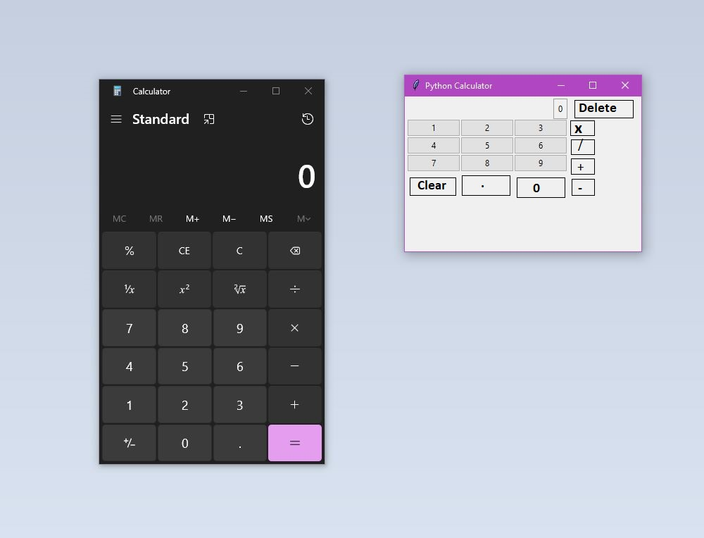

## known bugs:
1. calcLabel is not 'static'; expands outwardly from both sides with big numbers

# TO DO : 

1. add function buttons (add, sub, divide, multiply)
   - attach existing function from calculator.py
2. add equal button with function (take stored numbers and add)
3. ~~add decimal button~~
4. ~~add clear button~~
5. ~~add zero button~~
6. make sure all numbers are floats rather ints (more accurate calcuations?)
7. adjust GUI for bigger buttons/interface
---   
*See Image for rough draft image:*
> *Using Windows 10 standard calcuator for reference*

### Possible future tasks:

1. add positive/negative button
2. add modulo button
3. add square root button
4. add exponent button
5. add some kind of memory/previous list
6. updating the GUI to a modern look
